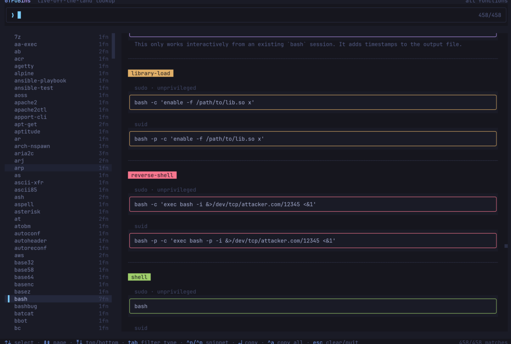

<h1 align="center">gbins</h1>

<p align="center">
  <a href="https://gtfobins.github.io">GTFOBins</a> in your terminal. Fuzzy-search, hit <code>↵</code>, paste the exploit.
</p>

<p align="center">
  
  
  
  
</p>



## Install

**Homebrew** (macOS arm64, Linux):

```bash
brew tap franlol/tap
brew install gbins
```

**Arch Linux (AUR)** — prebuilt binary or built from source (any AUR helper, e.g. `paru`/`yay`):

```bash
paru -S gbins-bin   # prebuilt binary
paru -S gbins       # built from source with bun
```

**Prebuilt binary** — grab a tarball for your platform from the
[latest release](https://github.com/franlol/gbins/releases/latest)
(`darwin-arm64`, `linux-x64`, `linux-arm64`), then:

```bash
tar -xzf gbins-*.tar.gz && sudo install -m755 gbins /usr/local/bin/
```

**From source** with [Bun](https://bun.sh):

```bash
bun install && bun run dev
```

Or compile a standalone binary. No runtime needed:

```bash
bun run build   # → dist/gbins
```

## Keys

| Key         | Action                       |
| ----------- | ---------------------------- |
| type        | filter binaries              |
| `↑` `↓`     | navigate                     |
| `Tab`       | cycle function type          |
| `^n` `^p`   | move snippet cursor          |
| `↵` / click | copy snippet                 |
| `^a`        | copy all snippets            |
| `^r`        | refresh from upstream        |
| `Esc`       | clear filter / quit          |

---

<p align="center">
  Live data from <a href="https://gtfobins.github.io">GTFOBins</a> · built on <a href="https://bun.sh">Bun</a> · MIT © franlol
</p>
